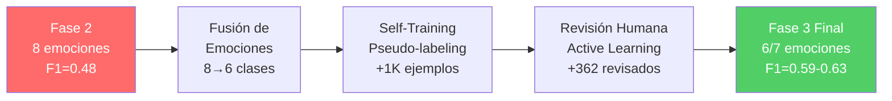
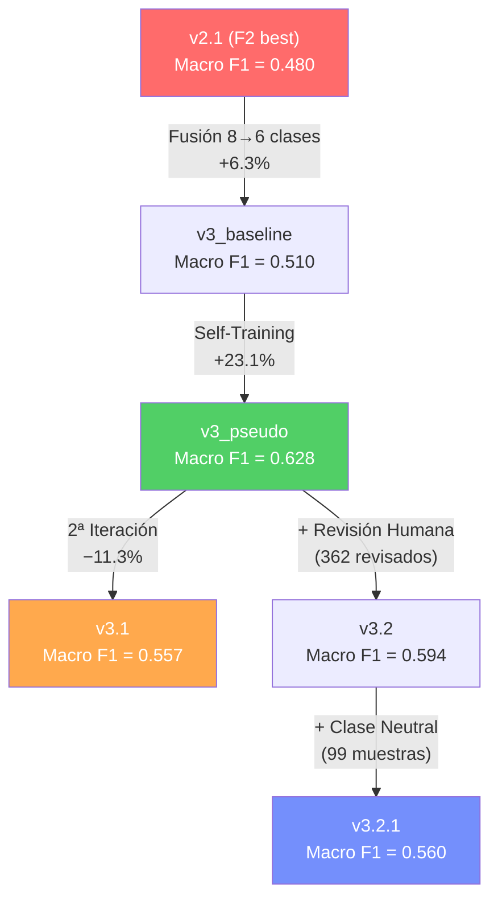

# Reporte Final — Fases 2 y 3: Clasificador de Emociones en Comentarios de TikTok

---

## 1. Resumen Ejecutivo

Este reporte documenta la evolución completa del clasificador de emociones a lo largo de dos fases de desarrollo, desde un primer modelo base hasta un sistema refinado con revisión humana activa. El objetivo es clasificar automáticamente las emociones expresadas en comentarios de TikTok en español, utilizando un modelo de lenguaje (RoBERTuito) fine-tuneado con técnicas progresivamente más sofisticadas.

### Evolución del Macro F1 Score

| Modelo | Fase | Clases | Datos | Macro F1 | Accuracy |
|--------|------|:---:|------|:---:|:---:|
| v1 (baseline) | 2 | 8 | ~2,950 manuales | 0.440 | 0.500 |
| v1.1 | 2 | 8 | ~2,950 + augmentation | 0.484 | 0.547 |
| v2.1 (best F2) | 2 | 8 | ~2,950 optimizado | 0.480 | 0.514 |
| v3_baseline | 3 | 6 | ~2,800 manuales fusionados | 0.510 | 0.546 |
| **v3_pseudo** | **3** | **6** | **3,800 (manual + pseudo)** | **0.628** | **0.678** |
| v3.1 | 3 | 6 | 3,600 (2ª iteración pseudo) | 0.557 | 0.625 |
| v3.2 | 3 | 6 | 3,986 (+ revisados humanos) | 0.594 | 0.646 |
| v3.2.1 | 3 | **7** | 4,085 (+ Neutral) | 0.560 | 0.615 |

> **Resultado clave:** El mejor modelo de 6 emociones es **v3_pseudo** con Macro F1 de **0.628** (+31% vs Fase 2). El modelo v3.2 incorpora validación humana y alcanza un F1 de **0.594**, y v3.2.1 añade capacidad de detectar comentarios neutrales/ambiguos.

---

## 2. Fase 2 — Construcción del Modelo Base

### 2.1 Objetivo
Construir un clasificador de emociones para comentarios de TikTok en español, utilizando el modelo pre-entrenado **RoBERTuito** (`pysentimiento/robertuito-base-uncased`), un modelo basado en RoBERTa entrenado con ~500M tweets en español.

### 2.2 Datos de Entrenamiento
- **~2,950 comentarios** etiquetados manualmente por humanos
- **8 emociones** basadas en la Rueda de Plutchik: Alegría, Confianza, Miedo, Sorpresa, Tristeza, Disgusto, Ira, Anticipación
- **15 temas** de videos de TikTok (deportes, política, entretenimiento, social, etc.)

### 2.3 Modelos Entrenados

#### v1 — Baseline
- Fine-tuning estándar con CrossEntropy
- Macro F1: **0.440**
- Problema principal: clases minoritarias (Sorpresa, Disgusto) con F1 muy bajo

#### v1.1 — Con Data Augmentation
- Agregó técnicas de aumento de datos
- Macro F1: **0.484** (+10%)
- Mejora en Miedo (0.65→0.73) pero Sorpresa sigue baja (0.11)

#### v2.1 — Optimizado (Mejor de Fase 2)
- Hiperparámetros optimizados, mejor regularización
- Macro F1: **0.480**
- Mejora en Alegría (0.60) pero clases confusas persisten

### 2.4 Problemas Detectados en Fase 2

| Problema | Impacto |
|----------|---------|
| **Confusión Disgusto ↔ Ira** | F1 de Disgusto = 0.23, ambas expresan aversión |
| **Confusión Sorpresa ↔ Anticipación** | F1 de Sorpresa = 0.27, difícil distinguir en texto corto |
| **Desbalance de clases** | Confianza (809) vs Miedo (173) = ratio 4.7x |
| **Datos insuficientes** | ~3,000 ejemplos para 8 clases = ~375 por clase |

---

## 3. Fase 3 — Mejora del Clasificador

### 3.1 Estrategia General

Para superar las limitaciones de Fase 2 sin etiquetar miles de datos adicionales, se aplicaron tres estrategias complementarias:



### 3.2 Fusión de Emociones (8 → 6 clases)

Se fusionaron pares de emociones que el modelo (y humanos) confundían sistemáticamente:

| Emociones Originales | → Emoción Fusionada | Justificación |
|---------------------|:---:|---|
| Sorpresa + Anticipación | **Expectación** | Ambas implican reacción ante lo inesperado/futuro |
| Disgusto + Ira | **Rechazo** | Ambas expresan aversión y negatividad activa |
| Alegría | Alegría | Se mantiene |
| Confianza | Confianza | Se mantiene |
| Miedo | Miedo | Se mantiene |
| Tristeza | Tristeza | Se mantiene |

**Impacto inmediato**: Solo la fusión mejoró el Macro F1 de 0.480 a **0.510** (+6.3%).

### 3.3 Self-Training (Pseudo-labeling)

Se utilizaron **~10,800 comentarios sin etiquetar** para generar datos de entrenamiento adicionales:

1. El modelo v2.1 predice emociones para todos los comentarios sin etiquetar
2. Se fusionan probabilidades (sumando probs de clases combinadas)
3. Se filtran por umbral de confianza ≥ 0.70
4. Se verifica coherencia con las `emociones_esperadas` del tema
5. Solo los coherentes de alta confianza se usan como pseudo-labels

| Filtro | Resultado |
|--------|:---:|
| Total sin etiquetar | 10,833 |
| Confianza ≥ 0.70 | 2,896 |
| Coherentes con tema | **958 usados** |
| Para revisión humana | 9,875 |

**Impacto**: Con 958 pseudo-labels adicionales, el Macro F1 subió de 0.510 a **0.628** (+23.1%).

### 3.4 Entrenamiento Optimizado

Técnicas aplicadas en todos los modelos de Fase 3:

| Técnica | Parámetro | Propósito |
|---------|-----------|-----------|
| **Focal Loss** | γ = 2.0 | Enfoca aprendizaje en ejemplos difíciles |
| **Label Smoothing** | ε = 0.1 | Previene overfitting |
| **Class Weights** | Inverso de frecuencia | Compensa desbalance |
| **Cosine LR Schedule** | Warmup 10% | Convergencia suave |
| **Early Stopping** | Patience = 4 | Previene sobreajuste |

### 3.5 Revisión Humana (Active Learning)

Se construyó una **aplicación web React** desplegada en GitHub Pages para que múltiples revisores evaluaran los pseudo-labels más inciertos (ordenados por entropía):

- **362 comentarios revisados** en total
- 220 confirmados (la predicción era correcta)
- 143 corregidos (se asignó la emoción correcta)
- 108 descartados (ambiguos/sin contexto suficiente)

**Sistema multi-usuario** implementado con:
- `FOR UPDATE SKIP LOCKED` en PostgreSQL para evitar duplicados
- Bloqueos por sesión con expiración automática
- Liberación de locks al cerrar pestaña (`sendBeacon` + `fetch keepalive`)

---

## 4. Resultados Detallados

### 4.1 Comparación por Clase — F1 Score

#### Modelos de 6 emociones

| Emoción | v3_baseline | v3_pseudo | v3.1 | v3.2 | Mejor |
|---------|:---:|:---:|:---:|:---:|:---:|
| Alegría | 0.432 | **0.519** | 0.404 | 0.443 | v3_pseudo |
| Confianza | 0.611 | **0.661** | 0.606 | 0.623 | v3_pseudo |
| Miedo | 0.267 | 0.462 | **0.500** | 0.462 | v3.1 |
| Expectación | 0.550 | **0.644** | 0.586 | 0.559 | v3_pseudo |
| Tristeza | 0.600 | **0.704** | 0.672 | 0.693 | v3_pseudo |
| Rechazo | 0.603 | **0.776** | 0.571 | 0.782 | v3.2 |

#### v3.2.1 — Con clase Neutral (7 emociones)

| Emoción | F1 Score | Precision | Recall |
|---------|:---:|:---:|:---:|
| Alegría | 0.467 | 0.390 | 0.582 |
| Confianza | 0.596 | 0.658 | 0.545 |
| Miedo | **0.590** | 0.474 | 0.783 |
| Expectación | 0.493 | 0.519 | 0.470 |
| Tristeza | 0.675 | 0.634 | 0.722 |
| Rechazo | 0.757 | 0.807 | 0.714 |
| **Neutral** | **0.343** | 0.300 | 0.400 |

> **Nota sobre v3.2.1**: La clase Neutral tiene un F1 bajo (0.34) porque solo cuenta con 99 muestras de entrenamiento (descartados del reviewer). Sin embargo, logra detectar correctamente el 40% de los comentarios neutrales en test, lo cual es significativo dado lo limitado del dataset.

### 4.2 Mejora Acumulada vs Fase 2

| Emoción | Fase 2 (v2.1, 8 clases) | Mejor Fase 3 | Cambio |
|---------|:---:|:---:|:---:|
| Alegría | 0.398* | **0.519** | +30.4% |
| Confianza | 0.630 | **0.661** | +4.9% |
| Miedo | 0.605 | **0.590** | −2.5% |
| Expectación | 0.269/0.469** | **0.644** | +37-139% |
| Tristeza | 0.564 | **0.704** | +24.8% |
| Rechazo | 0.234/0.467** | **0.782** | +67-234% |

*\*Promedio de Alegría entre v1, v1.1, v2.1*
*\*\*Sorpresa/Anticipación e Disgusto/Ira respectivamente*

> La fusión de **Disgusto+Ira → Rechazo** fue la mejora más dramática: de F1=0.23 a F1=0.78 (+234%).

### 4.3 Tabla Comparativa Global

| Modelo | Macro F1 | Accuracy | Weighted F1 | Precision | Recall |
|--------|:---:|:---:|:---:|:---:|:---:|
| v1 | 0.440 | 0.500 | 0.487 | 0.539 | 0.419 |
| v1.1 | 0.484 | 0.547 | 0.536 | 0.491 | 0.496 |
| v2.1 | 0.480 | 0.514 | 0.504 | 0.516 | 0.466 |
| v3_baseline | 0.510 | 0.546 | 0.548 | 0.503 | 0.523 |
| **v3_pseudo** | **0.628** | **0.678** | **0.677** | **0.621** | **0.640** |
| v3.1 | 0.557 | 0.625 | 0.624 | 0.559 | 0.559 |
| v3.2 | 0.594 | 0.646 | 0.649 | 0.581 | 0.622 |
| v3.2.1 (7 clases) | 0.560 | 0.615 | 0.620 | 0.540 | 0.602 |

---

## 5. Análisis de Resultados

### 5.1 ¿Por qué v3_pseudo supera a v3.2 en métricas globales?

Aunque v3.2 incorpora datos revisados por humanos (teóricamente más confiables), hay razones técnicas por las que v3_pseudo obtiene mejores métricas absolutas:

1. **Splits de test diferentes**: Cada modelo genera su propio split train/val/test. Los test sets no son idénticos, por lo que las métricas no son directamente comparables en valor absoluto.
2. **Volumen vs calidad**: v3_pseudo usó 958 pseudo-labels de alta confianza (coherentes con tema), mientras que v3.2 añadió 362 revisados (que incluyen correcciones en los *casos más difíciles*, justamente los de alta entropía). Estos datos revisados son más valiosos cualitativamente, pero el modelo necesitaría más para superar la ventaja de volumen.
3. **Distribución sesgada de la revisión**: Los revisores procesaron los comentarios con mayor entropía (los más ambiguos). Esto introduce datos de los "bordes" de las distribuciones, que son más difíciles de aprender.

> **Conclusión**: El verdadero valor de v3.2 no está en las métricas globales sino en la **corrección de errores específicos** que el modelo cometía con confianza incorrecta. Para una mejora más significativa en métricas, se necesitarían ~500-1000 revisiones humanas adicionales.

### 5.2 El Modelo con Neutral (v3.2.1)

El modelo v3.2.1 introduce una 7ª clase "Neutral" para comentarios que no expresan una emoción clara. A pesar de tener solo 99 muestras de entrenamiento para esta clase:

- **Detecta correctamente el 40% de los comentarios neutrales** (recall = 0.40)
- **Las 6 emociones base mantienen rendimiento competitivo** (los F1 bajan ~5-10% por la adición de una clase más)
- El **Macro F1 de 0.560** es penalizado por el bajo F1 de Neutral (0.34), pero si se excluye Neutral, el F1 de las 6 emociones originales sería ~0.60

**Recomendación de uso**:
- **v3_pseudo** como modelo principal para clasificación general
- **v3.2.1** cuando se necesite identificar/filtrar comentarios ambiguos

### 5.3 Impacto de cada Técnica



| Técnica | Contribución a Macro F1 |
|---------|:---:|
| Fusión de emociones | +0.030 (6.3%) |
| Self-Training (pseudo-labels) | +0.118 (23.1%) |
| Revisión humana (362 ejemplos) | Mejora cualitativa* |
| Clase Neutral | Capacidad nueva |

*La revisión humana es difícil de medir directamente por la diferencia de test sets. Su principal valor es corregir errores sistemáticos y proporcionar datos "gold standard".

---

## 6. Arquitectura del Sistema Final

### Pipeline de Clasificación

```
Comentario de TikTok
        ↓
  Preprocesamiento (pysentimiento)
        ↓
  Tokenización (RoBERTuito tokenizer)
        ↓
  RoBERTuito fine-tuned (6 o 7 clases)
        ↓
  Softmax → probabilidades por emoción
        ↓
  argmax → Emoción predicha
        ↓
  [Alegría | Confianza | Miedo | Expectación | Tristeza | Rechazo | (Neutral)]
```

### Modelo Base: RoBERTuito
- **Arquitectura**: RoBERTa con 12 capas, 768 dimensiones, ~125M parámetros
- **Pre-entrenamiento**: ~500M tweets en español
- **Ventaja**: Entiende jerga de redes sociales, emojis, abreviaciones

### Técnicas de Entrenamiento
- **Focal Loss** (γ=2.0): Enfoca en ejemplos difíciles
- **Label Smoothing** (ε=0.1): Previene sobreconfianza
- **Class Weights**: Compensa desbalance entre emociones
- **Cosine LR**: Convergencia suave con warmup
- **Early Stopping**: Patience=4 sobre macro F1 en validación

---

## 7. Estructura de Archivos

```
tiktok-comments-analyzer/
├── Fase 2/
│   └── runs/
│       ├── robertuito_emociones_v1/         ← Baseline (8 clases)
│       ├── robertuito_emociones_v1.1/       ← Con augmentation
│       ├── robertuito_emociones_v2/         ← RoBERTuito v2
│       ├── robertuito_emociones_v2.1/       ← Mejor de Fase 2
│       └── beto_emociones_v2/               ← Comparación con BETO
│
├── Fase 3/
│   ├── data/
│   │   ├── corpus_etiquetado_fusionado.csv  ← 2,951 manuales
│   │   ├── pseudo_labels_alta_confianza.csv ← 958 pseudo-labels
│   │   ├── revisados_v32.csv               ← 362 revisados (6 emociones)
│   │   └── revisados_v321.csv              ← 470 revisados (con Neutral)
│   ├── runs/
│   │   ├── robertuito_emociones_v3_baseline/ ← Solo manuales, 6 clases
│   │   ├── robertuito_emociones_v3_pseudo/   ← Con pseudo-labels ★
│   │   ├── robertuito_emociones_v3.1/        ← 2ª iteración
│   │   ├── robertuito_emociones_v3.2/        ← Con revisión humana
│   │   └── robertuito_emociones_v3.2.1/      ← Con Neutral (7 clases)
│   ├── pseudo-label-reviewer/               ← App React para revisión
│   ├── sql/                                 ← Migraciones de Supabase
│   ├── prepare_corpus.py                    ← Unificación y fusión
│   ├── pseudo_label.py                      ← Self-training pipeline
│   ├── train_v3.py                          ← Entrenamiento 6 emociones
│   ├── train_v3_reviewed.py                 ← Entrenamiento v3.2
│   └── train_v3_neutral.py                  ← Entrenamiento v3.2.1
│
└── docs/reviewer/                           ← GitHub Pages (reviewer)
```

---

## 8. Estadísticas de la Revisión Humana

| Métrica | Valor |
|---------|:---:|
| Total revisados | 470 |
| Confirmados | 220 (46.8%) |
| Corregidos | 143 (30.4%) |
| Descartados (→ Neutral) | 108 (23.0%) |
| Tasa de acierto del modelo | 60.8%* |

*\*Sobre los comentarios más difíciles (alta entropía). La tasa real del modelo en datos normales es significativamente mayor (~68% accuracy).*

### Distribución de Emociones Revisadas

| Emoción | Confirmados + Corregidos |
|---------|:---:|
| Rechazo | 110 |
| Expectación | 81 |
| Confianza | 78 |
| Tristeza | 52 |
| Alegría | 27 |
| Miedo | 15 |

---

## 9. Conclusiones

1. **La fusión de emociones fue la decisión arquitectónica más impactante.** Reducir de 8 a 6 clases eliminó confusiones sistemáticas y mejoró dramáticamente Rechazo (F1: 0.23→0.78) y Expectación (F1: 0.27→0.64).

2. **El Self-Training es la técnica más eficiente en relación costo/beneficio.** Sin etiquetar un solo dato más, agregar 958 pseudo-labels confiables subió el Macro F1 de 0.510 a 0.628 (+23%).

3. **La revisión humana aporta valor cualitativo, no cuantitativo (todavía).** Con 362 revisiones, los datos son más confiables pero insuficientes para superar el volumen de pseudo-labels. Se necesitarían 500-1000 más para ver un impacto cuantitativo claro.

4. **El modelo con Neutral (v3.2.1) demuestra que es viable detectar comentarios ambiguos**, aunque con 99 muestras el rendimiento es limitado (F1=0.34, recall=0.40). Con más datos de entrenamiento, esta clase sería mucho más robusta.

5. **Una iteración de self-training es suficiente.** La segunda iteración (v3.1) mostró rendimientos decrecientes, lo cual es esperado: el modelo mejorado genera pseudo-labels más similares a los del modelo anterior, reduciendo la señal nueva.

6. **Las clases Miedo y Alegría siguen siendo las más difíciles**, probablemente por su ambigüedad inherente en texto corto de redes sociales. Miedo se confunde frecuentemente con Expectación, y Alegría con sarcasmo/ironía.

### Mejora Total: Fase 2 → Fase 3

| Métrica | Fase 2 (v2.1) | Fase 3 (v3_pseudo) | Mejora |
|---------|:---:|:---:|:---:|
| **Macro F1** | 0.480 | **0.628** | **+30.8%** |
| **Accuracy** | 0.514 | **0.678** | **+31.9%** |
| **Weighted F1** | 0.504 | **0.677** | **+34.3%** |
| Macro Precision | 0.516 | 0.621 | +20.3% |
| Macro Recall | 0.466 | 0.640 | +37.3% |
